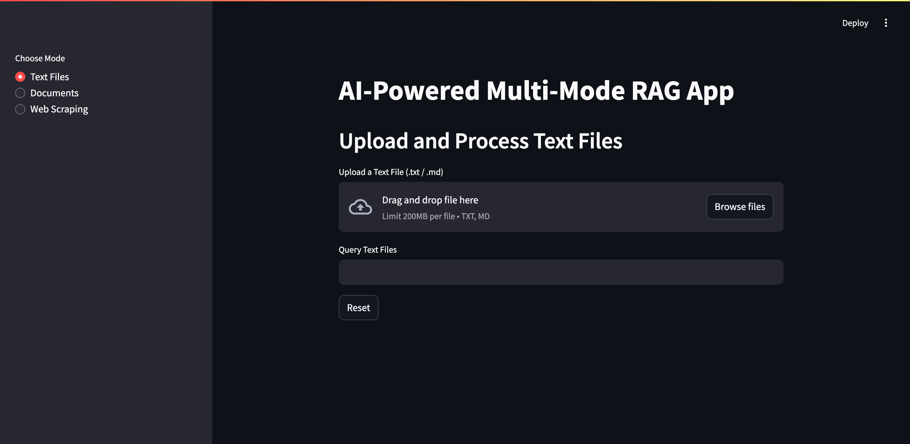

# llm-rag
AI-Powered Multi-Mode RAG App

Welcome to the **AI-Powered Multi-Mode RAG App** repository! This project provides a Python application built using **Streamlit**, **ChromaDB**, and **Ollama**. It allows users to upload multiple file formats (TXT, MD, PDF, DOCX, ODT, RTF), scrape web pages, and perform queries on extracted content using powerful large language models (LLM).

This repository simplifies the process of extracting text content from various documents and webpages, storing it in a vector database (ChromaDB), and using AI models for retrieval-augmented generation (RAG) to enhance querying accuracy.

## Contents

1. [Repository](#1-repository)
2. [Features](#2-features)
3. [Installation and Usage](#3-installation-and-usage)
4. [Technologies Used](#4-technologies-used)
5. [License](#5-license)
6. [Author](#6-author)

## 1. Repository
This repository contains the following files:
- [`llm_rag.py`](llm_rag.py) - Python file containing all the codes
- [`requirements.txt`](requirements.txt) - A list of Python libraries required to run this app
- [`README.md`](README.md) - Documentation and instructuions


## 2. Features

- Upload and process various text files (TXT, MD) and document files (PDF, DOCX, ODT, RTF) and store content in ChromaDB.
- Scrape web pages, store content in ChromaDB, and perform queries.
- Perform queries across PDFs, documents, and web scraped data with powerful language model support.
- Unified app that can handle different types of documents and web scraping in one place.

## 3. Installation and Usage

### 1. Clone the Repository
```sh
git clone https://github.com/bernardtse/llm-rag.git
cd llm-rag
```

### 2. Install Dependencies
```sh
pip install -r requirements.txt
```
Note: Ensure Python 3 is installed, and that the libraries in `requirements.txt` are compatible with each other, as some versions may conflict and cause errors.

### 3. Install Ollama

Ollama is required to run the LLM models. Visit Ollama’s [official website](https://ollama.com/download) for installation details.

### 4. Pull Required Models

Before running the app, you will need to pull the necessary models. Use the following commands to download the models required for the app:

```sh
ollama pull llama3.2  # LLM Model
ollama pull nomic-embed-text  # Embedding Model
```

### 5. Usage

#### Ensure Ollama is Running:

Before proceeding, make sure that Ollama is running. You can start Ollama using either the graphical user interface (GUI) or by running the following command:
```sh
ollama serve
```
To verify that Ollama is running, open your browser and go to [http://localhost:11434](http://localhost:11434]). If the application is active, you should see the message: `Ollama is running`.

#### Run the main application:
```sh
streamlit run llm_rag.py
```

#### Instructions of Usage:

Text Files Processing:
- Upload TXT or MD files → Extract text → Store embeddings in ChromaDB → Query text-based files

Document Files Processing:
- Upload documents (PDF, DOCX, ODT, RTF) → Extract content → Store embeddings in ChromaDB → Query documents

Web Scraping:
- Enter a URL → Extract webpage content → Store embeddings in ChromaDB → Query scraped data

### 6. Changing Models

By default, the application uses `llama3.2` as the LLM model and `nomic-embed-text` as the embedding model. You can modify the models used in the Python file. Details of each model can be found on Ollama's [website](https://ollama.com/models). If you wish to use different models, you can pull your preferred models from Ollama. Here’s how:

```sh
ollama pull your-preferred-llm-model  # LLM Model
ollama pull your-preferred-embedding-model  # Embedding Model
```

In `llm_rag.py`, you will find model selection variables at the top. Modify these lines to set your preferred models:

```
LLM_MODEL = "llama3.2"  # Change this for your preferred LLM model
EMBEDDING_MODEL = "nomic-embed-text"  # Change this for your preferred embedding model
```

Simply update the model names and re-run the app.

## 4. Technologies Used

- **LangChain** - Document processing & embeddings
- **BeautifulSoup** - Web scraping
- **ChromaDB** - Vector database for storing embeddings
- **Ollama** - AI tool for generating contextual natural language responses
- **Streamlit** - Web UI for the application



## 5. License

This project is licensed under the MIT License. See the [LICENSE](LICENSE) file for more information.

## 6. Author

- This project is developed and maintained by [Bernard Tse](https://github.com/bernardtse), with assistance from [OpenAI](https://openai.com)’s ChatGPT in areas such as code refinement, optimisation, and debugging.
- This project was initially inspired by an [article](https://medium.com/@arunpatidar26/rag-chromadb-ollama-python-guide-for-beginners-30857499d0a0) I read on Medium that helped me understand the topic and get started. The article provided a helpful starting point and sample code which I used as a foundation when exploring the topic. Since then, the code has been extensively modified, extended, and refactored, to the point where it is now almost entirely different in structure and functionality.